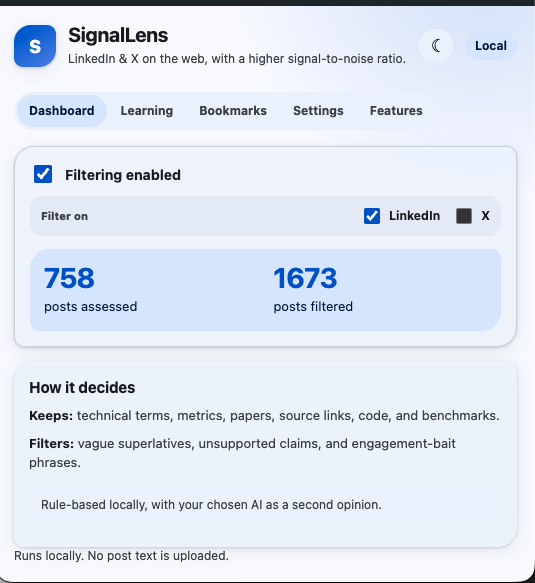
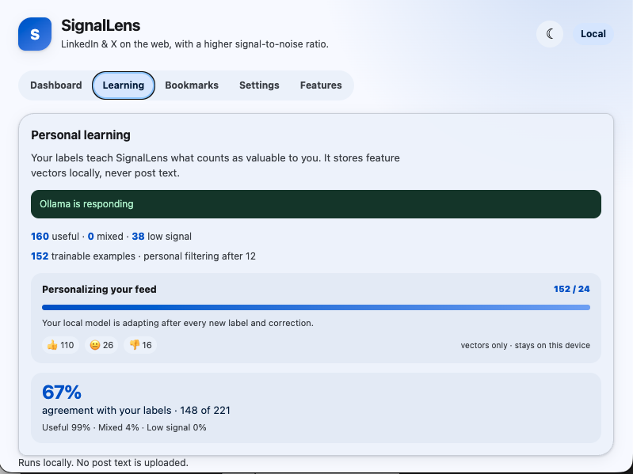
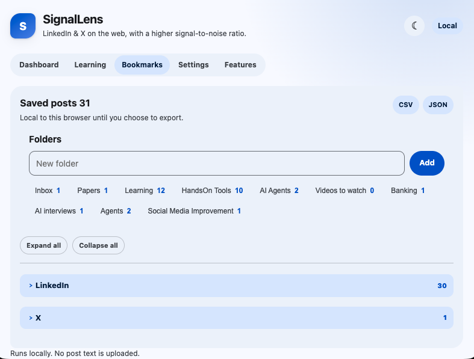
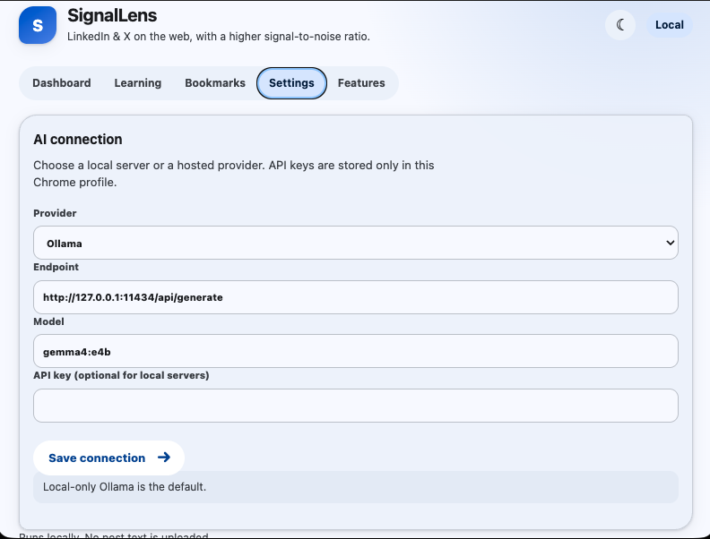
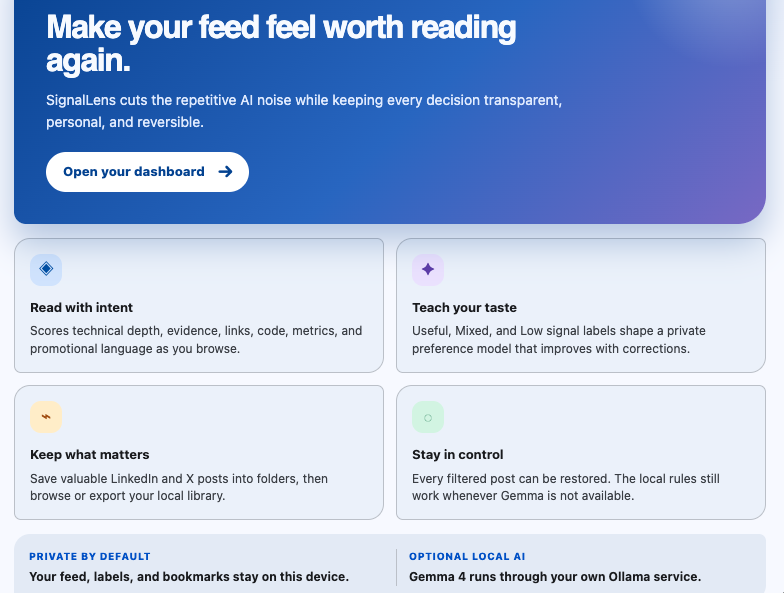
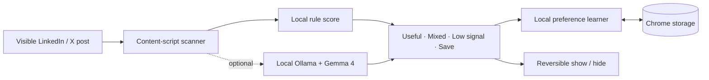

# SignalLens for LinkedIn & X on the web

> A local-first signal filter for professional and technical social feeds.

SignalLens helps you spend less time on vague AI hype and more time on posts with real substance. It runs in the browser, reads visible posts as you scroll, and lets you teach it what is useful, mixed, or low signal.

## In action

SignalLens has a responsive, light/dark dashboard, live on-post controls, a private learning view, bookmarks, settings for local and hosted AI providers, and a first-run persona/topic setup. It works on the LinkedIn feed and X Home timeline.

### Dashboard



### Personal learning



### Bookmarks



### AI provider settings



### Features



## Latest changes

- **Author learning:** a Useful label gives that author’s later posts a local keep-visible prior; Low Signal feedback can reduce it.
- **More conservative filtering:** posts with video, LangChain, and trusted sources are not auto-hidden.
- **Readable filtered previews:** notices show the post copy itself, excluding LinkedIn author, follower, promotional, CTA, and reaction metadata.
- **Local interests that actually count:** persona and selected topics map to related technical vocabulary during scoring.
- **Resilient X controls:** X-only feed controls, saves, and independent site toggles account for its virtualized navigation.

## What it does

- Scores visible posts locally as they enter your LinkedIn or X feed, with independent per-site filtering controls.
- Supports a second opinion from **Ollama, LM Studio, Jan, OpenAI, Anthropic**, or another OpenAI-compatible endpoint.
- Lets you mark posts as **👍 Useful**, **😐 Mixed**, or **👎 Low signal**.
- Learns from new labels with a compact three-class preference model stored in Chrome.
- Hides low-signal and mixed-relevance posts, while keeping every decision reversible.
- Saves posts into local bookmark folders, with a dedicated bookmarks library.
- Exports bookmarks as **CSV** for spreadsheets or **JSON** for integrations.
- Uses an adaptive Material-style interface with automatic and manual light/dark themes.
- Starts with a persona-guided setup and 30 selectable topics, then lets you change course through your labels.

## Privacy model

SignalLens is local-first by design.

- Post classification rules run inside the extension.
- Preference-learning features and labels live in Chrome storage on this device.
- Bookmark data is stored locally until you export it.
- When enabled, Gemma receives visible post text only through your local Ollama service at `127.0.0.1`.
- No cloud service, account, or API key is required for the local prototype.

## Install locally

1. Open `chrome://extensions`.
2. Enable **Developer mode**.
3. Click **Load unpacked**.
4. Choose this repository folder.
5. Open or refresh LinkedIn or X.

Use the extension icon to open the dashboard. Reload the extension from Chrome’s extension page after pulling updates.

### Optional local Gemma setup

SignalLens can use `gemma4:e4b` through a local Ollama server. Because Ollama protects its API from unknown browser origins, it must be configured to allow Chrome extensions before Gemma judgments can work.

On macOS, set `OLLAMA_ORIGINS` to `chrome-extension://*` with `launchctl`, then restart Ollama. This grants local Ollama access to installed Chrome extensions; use a specific extension origin instead if you need a stricter policy. The model and all post text remain on your device. See the [Ollama origin configuration guidance](https://docs.ollama.com/faq).

## How SignalLens decides

The local fast path rewards concrete technical signals—measurements, benchmarks, papers, source links, code, model and system details—and discounts generic superlatives, unsupported claims, and engagement bait.

Gemma 4 then provides a structured second opinion:

- **Useful** — new, supported, and practically usable insight.
- **Mixed** — legitimate content that may not be consistently relevant or useful to you.
- **Low signal** — vague, promotional, repetitive, or unsupported content.

Your labels are the source of truth. The learner retains only a small numeric feature vector for each new label, then begins adapting borderline decisions after enough examples are collected.

## Bookmarks

Save any post into a local folder from its on-post control. In the **Bookmarks** view you can:

- Create and rename folders.
- Open saved post links.
- Export your library as CSV or JSON.

JSON is the preferred handoff format for a future account-backed sync or a direct TweetSmash integration; CSV is ideal for Google Sheets, Excel, and other tabular tools.

## Architecture



The scanner is designed for virtualized feeds: it rescans after feed updates, in-app navigation, and tab activation so controls remain attached without a page refresh. See the [full architecture document](docs/ARCHITECTURE.md) for component responsibilities, data boundaries, local Ollama setup, and the hosted-phase plan.

## Roadmap

- Account-backed sync for bookmarks and preferences.
- Optional hosted inference and metered paid plans.
- Cross-application bookmark library and TweetSmash handoff.
- Better calibration reports and user-controlled filter strictness.

## Development

This prototype is intentionally dependency-free:

```text
manifest.json   Chrome extension manifest
content.js      Feed detection, controls, and local learning
content.css     Feed overlays and on-post UI
background.js   Local Gemma bridge and bookmark exports
popup.*         Extension dashboard and bookmark library
```

Before publishing changes, reload the unpacked extension and test both a LinkedIn feed and an X timeline.
