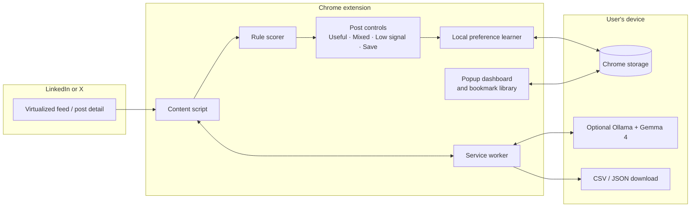

# SignalLens architecture

SignalLens is a local-first Chrome extension that improves social-feed quality on LinkedIn and X. The current implementation is deliberately account-free: feed text, labels, bookmarks, and learned preferences remain in the browser unless the user explicitly exports them.

## System overview

## Feed lifecycle

1. The content script detects visible LinkedIn or X post cards.
2. It creates a stable post identity from an activity or post URL, or a local fingerprint when no stable URL is available.
3. A local rule scorer produces a fast initial signal score.
4. The extension injects a compact post control with Useful, Mixed, Low signal, and Save actions.
5. When Ollama is available, the service worker sends the visible post text to the local Gemma endpoint for an optional second opinion.
6. The user can override any result. Mixed and Low signal are hidden with a reversible show/hide control.
7. Feed mutation, navigation, visibility, and focus handlers rescan virtualized feed updates so controls reattach without a page refresh.

## Local preference learning

The learner is a three-class softmax classifier: Useful, Mixed, and Low signal. It retains feature vectors and labels, not raw post text.

The feature vector includes:

- Technical depth and evidence terms.
- Measurements, links, code markers, and citations.
- Firsthand implementation language.
- Promotional or engagement-bait language.
- Post length and vocabulary diversity.

Each label is recorded as a pre-vote prediction for the agreement metric. After enough examples are available, the learner retrains across the local example set. Training weights rebalance dominant labels so a large Useful class does not erase Low-signal or Mixed preferences.

## Storage boundaries

| Data | Location | Purpose |
| --- | --- | --- |
| Extension settings, labels, feature vectors, model weights, bookmarks | `chrome.storage.local` | Persist local preferences on this browser profile |
| Seen post identities | `chrome.storage.session` | Count each assessed post once per browser session |
| Optional Gemma request | `127.0.0.1:11434` or `localhost:11434` | Local-only inference through Ollama |
| CSV / JSON export | User-selected download | Portable bookmark backup or integration input |

No hosted SignalLens API is used in the current phase.

### Local Ollama origin access

Ollama enforces browser-origin protections. For the optional Gemma path, its local server must permit the Chrome extension origin through `OLLAMA_ORIGINS`. During unpacked development, `chrome-extension://*` is the practical setting because Chrome can assign an extension identifier at load time. For a production distribution, prefer allowing only SignalLens’s fixed extension origin.

SignalLens tries both loopback addresses, serializes Gemma requests so a local model is not saturated, retains the model in memory for 15 minutes after use, and makes the live connection state visible in the Learning tab. If the local service is unavailable or declines a request, rule-based scoring and the local preference learner continue to work.

## Components

| Component | Responsibility |
| --- | --- |
| `content.js` | Feed detection, resilient rescanning, rule scoring, post controls, labels, bookmarks, and local learner |
| `background.js` | Ollama bridge, session-unique assessment counter, and bookmark exports |
| `popup.*` | Dashboard, theme control, accuracy reporting, and the source-aware bookmark tree |
| `content.css` | In-feed controls, hidden-post notices, and platform-specific layout treatment |

## Future hosted phase

The paid phase should be additive rather than a replacement for the local path. A user could opt into an authenticated service for account sync, cross-device bookmarks, cross-application integrations, and stronger remote inference. The extension should continue to support local-only rules, learner, and export when that service is unavailable.
